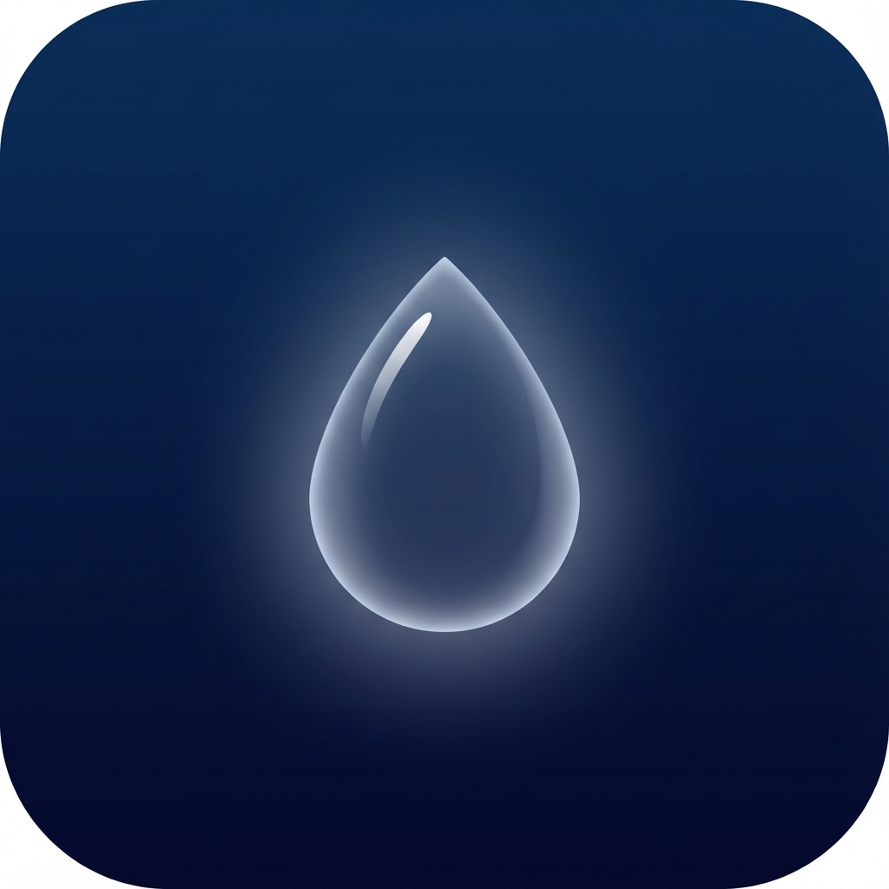

# 🌧️ RAIN

> **Nervous system regulation through sensory consistency.**

RAIN is a quiet app where you open it and let rain steady your body.  
No words. No tasks. Just weather.

---

<p align="center">
  
</p>

<p align="center">
  <strong>Slowing the body. Reducing internal noise. Creating safety through predictability.</strong>
</p>

---

## ✨ What is RAIN?

RAIN is not a meditation app. It's not sleep coaching. It's not ASMR content.

RAIN is **an environment** — a passive, sensory experience that works even if you do nothing.

| RAIN IS | RAIN IS NOT |
|---------|-------------|
| An environment | Meditation |
| A pause | ASMR content |
| A physical experience | Sleep coaching |
| Passive, not interactive | A timer app |
| Dim, not dark | A productivity tool |
| Present, not instructive | A "focus" app |

> *RAIN doesn't ask you to calm down. It assumes calm.*

---

## 🎯 Core Philosophy

The goal is not relaxation and not sleep. The goal is:

**Nervous system regulation through sensory consistency**

This means:
- Slowing the body
- Reducing internal noise  
- Creating safety through predictability

---

## 🎨 Features

### 🌧️ Ultra-Realistic Rain Effect
- **2-pass shader pipeline** for photorealistic water-on-glass
- Organic water droplets with natural physics
- Multi-layer depth (foreground, midground, background)
- Subtle trails where drops have traveled
- Ground ripples at impact points

### 🤫 Invisible Interaction
- **Long press anywhere** → rain subtly intensifies
- **Release** → slowly returns to baseline
- No UI, no text, no confirmation
- Agency without thinking

### 🎧 Seamless Audio
- Premium rain recording
- **Crossfade looping** — no gaps, ever
- Volume responds to intensity interaction
- Wide stereo presence

### 🌙 Minimal Entry
- Full black screen on launch
- Rain sound starts before visuals
- First launch only: *"Just listen."* (then never again)
- Fade transition to rain

### 🚫 Intentional Exclusions
- ❌ No text after first launch
- ❌ No timers or session lengths
- ❌ No tracking or stats
- ❌ No wellness claims
- ❌ No sound variants (v1)

---

## 🏗️ Tech Stack

| Component | Technology |
|-----------|------------|
| Framework | Flutter 3.10+ |
| Language | Dart |
| Graphics | Custom GLSL Fragment Shaders |
| Audio | audioplayers package |
| State | Simple StatefulWidget |

### Shader Architecture

```
┌─────────────────────────────────────────┐
│           rain_buffer_a.glsl            │
│  • Generates water droplet data         │
│  • Organic shapes with noise distortion │
│  • Multi-layer drops at different depths│
│  • Trail physics                        │
└─────────────────────────────────────────┘
                    ↓
┌─────────────────────────────────────────┐
│          rain_composite.glsl            │
│  • Applies refraction to background     │
│  • Fresnel rim highlights               │
│  • Light caustics                       │
│  • Fog/mist blending                    │
└─────────────────────────────────────────┘
```

---

## 📁 Project Structure

```
lib/
├── main.dart                    # App entry, services init
├── app/
│   └── rain_app.dart           # MaterialApp config
├── core/
│   ├── constants/
│   │   ├── app_colors.dart     # Color palette
│   │   └── app_durations.dart  # Timing + audio config
│   └── services/
│       ├── first_launch_service.dart  # One-time "Just listen."
│       └── sound_service.dart         # Crossfade audio looping
└── features/rain/
    ├── screens/
    │   ├── entry_screen.dart   # Arrival flow
    │   └── rain_screen.dart    # Main rain experience
    └── widgets/
        ├── film_grain_overlay.dart  # Cinematic texture
        ├── offscreen_buffer.dart    # Shader buffer renderer
        ├── rain_painter.dart        # CPU rain drops
        └── rain_ultra.dart          # 2-pass shader widget

shaders/
├── rain_buffer_a.glsl   # Droplet generation
└── rain_composite.glsl  # Final compositing

assets/
├── audio/rain.mp3       # Rain sound
└── images/app_icon.png  # App icon
```

---

## 🚀 Getting Started

### Prerequisites
- Flutter SDK 3.10+
- Android Studio / VS Code
- Android device or emulator

### Installation

```bash
# Clone the repository
git clone https://github.com/Maher-Tec/RAIN.git
cd rain

# Get dependencies
flutter pub get

# Generate app icons (optional, already generated)
dart run flutter_launcher_icons

# Run the app
flutter run
```

### Build Release

```bash
# Android APK
flutter build apk --release

# Android App Bundle
flutter build appbundle --release
```

---

## 🎯 Success Criteria

RAIN is successful if:

- ✅ Users open it without thinking
- ✅ Users leave it running in the background
- ✅ Users cannot explain why it helps
- ✅ Reviews say: *"It just feels right."*

> *If users talk about features → you failed.*  
> *If they talk about feeling → you succeeded.*

---

## 📱 Screenshots

<p align="center">
  <i>Screenshots coming soon</i>
</p>

---

## 🤝 Contributing

RAIN is intentionally minimal. Before contributing, ask:

1. Does this add complexity?
2. Does this require explanation?
3. Does this draw attention to itself?

If yes to any → it probably shouldn't be added.

---

## 📄 License

This project is licensed under the MIT License - see the [LICENSE](LICENSE) file for details.

---

## 🙏 Acknowledgments

- Inspired by the philosophy of *sensory regulation*
- Shader techniques inspired by [Shadertoy](https://shadertoy.com) community
- Audio engineering focused on *safety through predictability*

---

<p align="center">
  <strong>🌧️ Just listen.</strong>
</p>
